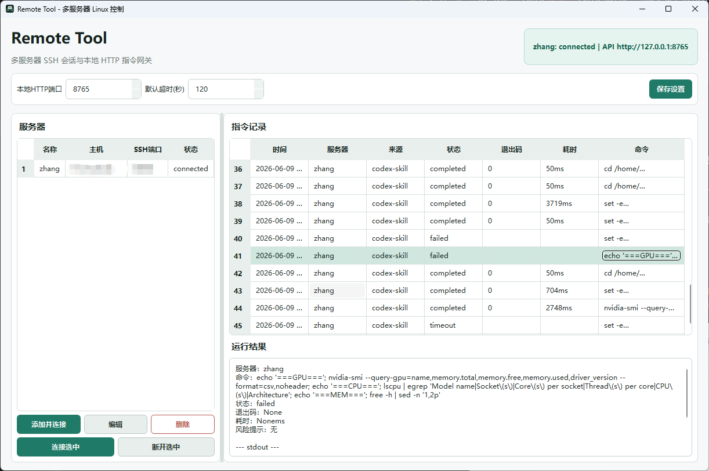

# RemoteTool

RemoteTool 是一个本地远程 Linux 控制中间程序。它在本机启动图形界面和仅绑定 `127.0.0.1` 的 HTTP API，在 GUI 中保存并连接服务器，Codex 或其他自动化工具只通过本地 HTTP API 提交 Linux 命令。

这样可以避免把远程服务器 IP、账号、密码直接发送到聊天窗口中。Codex 只需要知道已保存的服务器名称、HTTP 端口和本地 token。

## 功能

- 可同时连接多台服务器或多个账号供Agent使用。
- 本地 HTTP API 默认监听 `127.0.0.1:8765`，端口可在 GUI 中修改。
- 每条命令必须指定服务器名称，避免多服务器场景下发错目标。
- 命令自动执行，GUI 中可查看命令、状态、stdout、stderr、退出码和耗时。
- SSH 使用持久 shell，`cd`、`export` 等状态会影响后续命令。
- 连接服务器信息加密保存到本地配置文件。
- 内置 Skill，方便 Agent 在没有对话历史时按固定规则访问本地 API。

## 安装方法

### 方式一：下载安装包

1. 打开 GitHub 仓库的 Releases 页面，下载安装包和 skill。
2. 在 GUI 中添加服务器，输入服务器名称、IP、端口、账号和密码。
3. 点击连接，连接成功后即可通过 GUI 或本地 HTTP API 执行命令。

安装后程序会默认使用当前用户目录保存配置：

```text
%APPDATA%\RemoteTool\config.json
%APPDATA%\RemoteTool\config.key
```


### 方式二：从源码运行

需要先安装：

- Python 3.10 或更高版本
- uv
- Git

克隆仓库：

```bash
git https://github.com/24kzhang/SSH-Tool-for-Agent.git
cd remote-tool
```

安装依赖：

```bash
uv sync --extra test --extra build
```

如果 PyPI 访问较慢，可以使用镜像：

```bash
uv sync --extra test --extra build --index-url https://pypi.tuna.tsinghua.edu.cn/simple
```

启动 GUI：

```bash
uv run python app.py
```


## 使用

1. 启动 RemoteTool。
2. 在主界面修改本地 HTTP 端口和默认命令超时时间，按需保存。
3. 点击添加服务器，在弹窗中输入连接信息。
4. 服务器名称不能重复，Agent 和 HTTP API 都通过这个名称选择目标服务器。
5. 点击连接，状态变为已连接后即可执行远程命令。
6. 主界面会显示来自 Agent 或本地 API 的命令和执行结果。




## Agent 调用方式

推荐通过本地 HTTP API 调用。配置文件中保存了当前 API host、port 和 token，所以即使用户在 GUI 中修改了端口，Agent 也可以通过读取配置文件找到正确端口。但可能要显示指定 skill。


### Skill

安装完成后，安装目录中包含 skills 文件夹，将 skills 中的 remote-server-control 放到 Codex 的 skills 文件夹下，其他 Agent 同理：

```text
skills/remote-server-control
```

这个 Skill 不硬编码安装目录或 HTTP 端口。Codex 使用时应先读取：

1. `REMOTE_TOOL_CONFIG_PATH`
2. Windows 默认路径：`%APPDATA%\RemoteTool\config.json`
3. Linux 或 macOS 默认路径：`$XDG_CONFIG_HOME/remote-tool/config.json` 或 `~/.config/remote-tool/config.json`

Skill 只读取 `api_host`、`api_port`、`api_token` 和 `servers[].name`，不要输出或暴露服务器连接信息。


源码版也可以使用 `client.py`：

```powershell
uv run python client.py --server "dev" pwd
uv run python client.py --server "dev" conda env list
uv run python client.py --server "prod" --timeout 30 uptime
```

注意：`--server`、`--timeout` 等参数必须放在 Linux 命令前面。

## 本地 HTTP API

所有需要鉴权的接口都必须带请求头：

```text
X-Remote-Token: 配置文件中的 api_token
```

接口列表：

- `GET /api/health`
- `GET /api/servers`
- `POST /api/commands`
- `GET /api/commands/{id}`

PowerShell 示例：

```powershell
$configPath = $env:REMOTE_TOOL_CONFIG_PATH
if (-not $configPath) {
  $configPath = Join-Path $env:APPDATA "RemoteTool\config.json"
}

$cfg = Get-Content $configPath -Raw | ConvertFrom-Json
$headers = @{ "X-Remote-Token" = $cfg.api_token }
$base = "http://$($cfg.api_host):$($cfg.api_port)"

$body = @{
  server = "dev"
  cmd = "pwd"
  timeout = 30
  source = "manual-http"
} | ConvertTo-Json

$created = Invoke-RestMethod -Method Post -Uri "$base/api/commands" -Headers $headers -Body $body -ContentType "application/json"
Invoke-RestMethod -Method Get -Uri "$base/api/commands/$($created.id)" -Headers $headers
```

多服务器场景下必须明确传入 `server` 名称，不能只依赖默认服务器。


## 配置文件

默认配置位置：

```text
Windows: %APPDATA%\RemoteTool\config.json
Linux:   ~/.config/remote-tool/config.json
macOS:   ~/.config/remote-tool/config.json
```

可以用环境变量覆盖：

```text
REMOTE_TOOL_CONFIG_PATH
```

服务器连接信息会加密保存到 `config.json`，解密 key 保存在同目录的 `config.key`。如果丢失 `config.key`，已保存的服务器连接信息将无法解密，需要重新添加服务器。

## 安全说明

- 本地 API 默认只绑定 `127.0.0.1`。
- 本地 API 使用随机 token 鉴权。
- Codex 不需要知道服务器 IP、账号或密码。
- 保存的服务器信息是本地简单加密，不等同于系统级安全凭据管理。
- 不要把 `config.json`、`config.key`、日志、打包产物或虚拟环境提交到 GitHub。
- v1 仅支持密码登录，后续可以扩展 SSH key、系统凭据管理器和更细的权限控制。
- 命令会自动执行，请只在可信环境中运行 RemoteTool。

## 开发

运行测试：

```bash
uv run --extra test pytest -q
```

语法检查：

```bash
uv run python -m py_compile app.py client.py config.py paths.py remote.py server.py
```

常用项目结构：

```text
app.py                         GUI 和本地 API 启动入口
client.py                      命令行 HTTP 客户端
config.py                      配置读写、加密和迁移
paths.py                       配置路径解析
remote.py                      SSH 持久 shell 执行
server.py                      FastAPI 本地接口
assets/                        图标资源
installer/windows/             Windows 安装包脚本
skills/remote-server-control/  Codex Skill
tests/                         自动化测试
```

## 许可证

本项目使用 MIT 许可证，详见 `LICENSE`。
